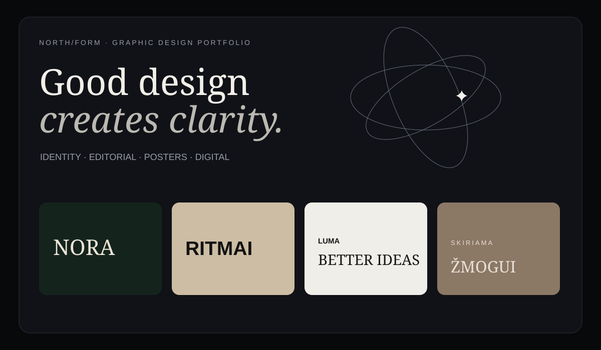

# NORTH/FORM — Graphic Design Portfolio

> Fictional graphic-design portfolio / concept repository.

NORTH/FORM is a small independent visual-design studio concept focused on identity systems, editorial layouts, posters and digital interfaces. The projects in this repository are **fictional case studies** created as portfolio demonstration material.



## Selected work

| Project | Discipline | Status |
|---|---|---|
| **NORA** | Brand identity | Concept case study |
| **RITMAI** | Poster / cultural campaign | Concept case study |
| **LUMA** | Digital / web design | Concept case study |
| **SKIRIAMA ŽMOGUI** | Editorial design | Concept case study |

## Design approach

**01 — Reduce**  
Remove visual noise until the message is clear.

**02 — Structure**  
Use typography, grid and spacing as the primary design system.

**03 — Give it character**  
Introduce one memorable visual gesture rather than many competing ones.

## Repository structure

```text
.
├── README.md
├── assets/
│   ├── portfolio-preview.svg
│   ├── nora.svg
│   ├── ritmai.svg
│   ├── luma.svg
│   └── skiriama-zmogui.svg
├── projects/
│   ├── luma.md
│   ├── nora.md
│   ├── ritmai.md
│   └── skiriama-zmogui.md
└── site/
    ├── index.html
    ├── styles.css
    └── script.js
```

## Portfolio site

Open `site/index.html` locally, or enable GitHub Pages for the repository.

## Note

This is intentionally fictional portfolio material. Replace the studio name, project names, imagery, copy and contact details with genuine work before using it as a professional portfolio.
